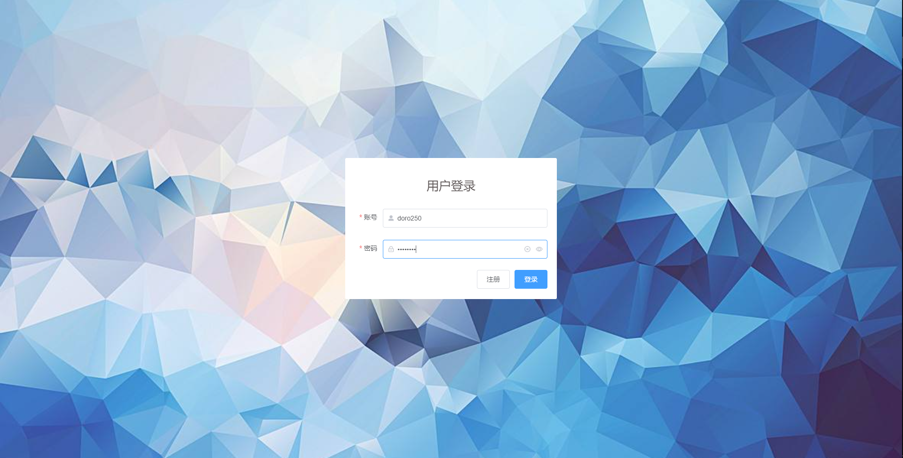
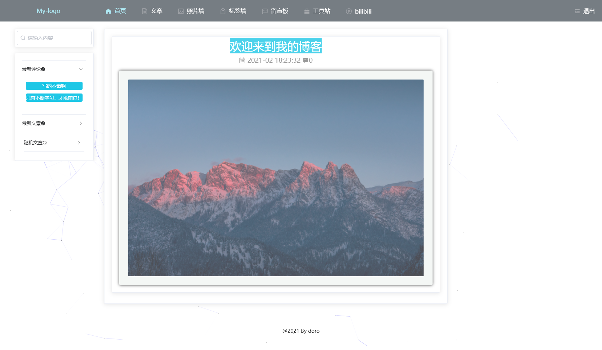
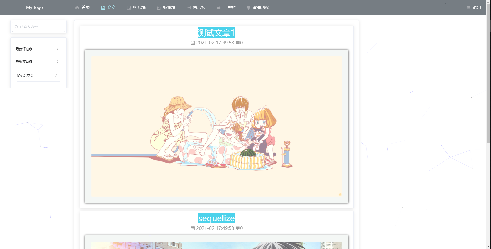
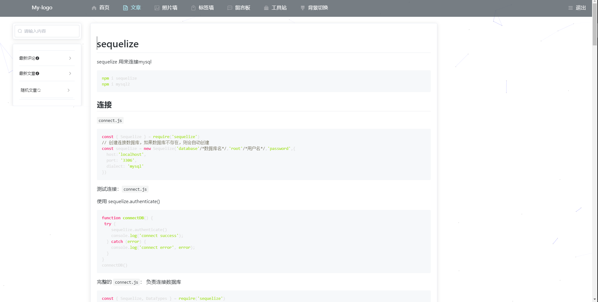
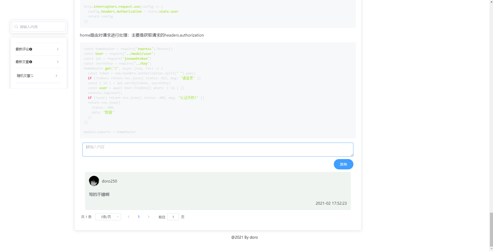
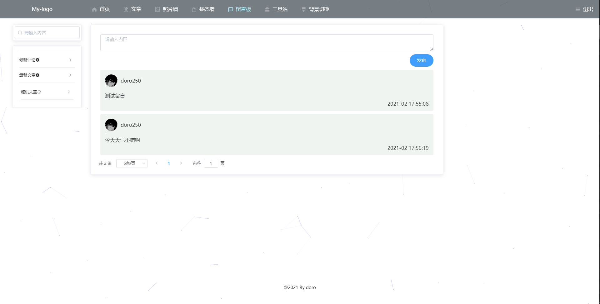
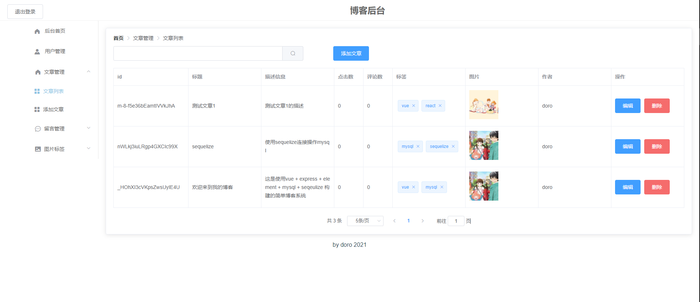

# doro-blog
前后端,后台分离的个人博客

# 运行项目

## 前端页面
cd web
```
npm install
npm start
```
- 登录

- 首页

- 文章列表

- 文章详情

- 评论

- 留言板

## 管理页面
cd blog-admin
```
npm install
npm start
```

## 后端
cd server
```
npm install
npm start
```
# 接口
## web  http://localhost:3333/web

### 用户

- 登录  /user/login

```
请求方式：post,
url: /user/login
```

-  注册 /user/register

```
请求方式: post,
url: /user/register
```

-  获取用户

```
get,
url: /user/:id
```

### 文章

-  全部文章

```
get,
/articles
```

- 最新文章

```
get,
/articles/newest
```

- 随机文章

```
get，
/some/articles
```

-  文章详情

```
get,
/articles/:id
```

### 搜索

```
get,
/search
通过query里的key
```

### 评论

- 最新评论

```
get,
/comments/newest
```

-  获取文章评论

```
get,
/article/:id/comments
```

- 添加文章评论

```
post,
/article/:id/comments
```

### 留言

-  所有留言

```
get,
/messages
```

发布留言

```
post,
/add/messages
```

## admin

。。。